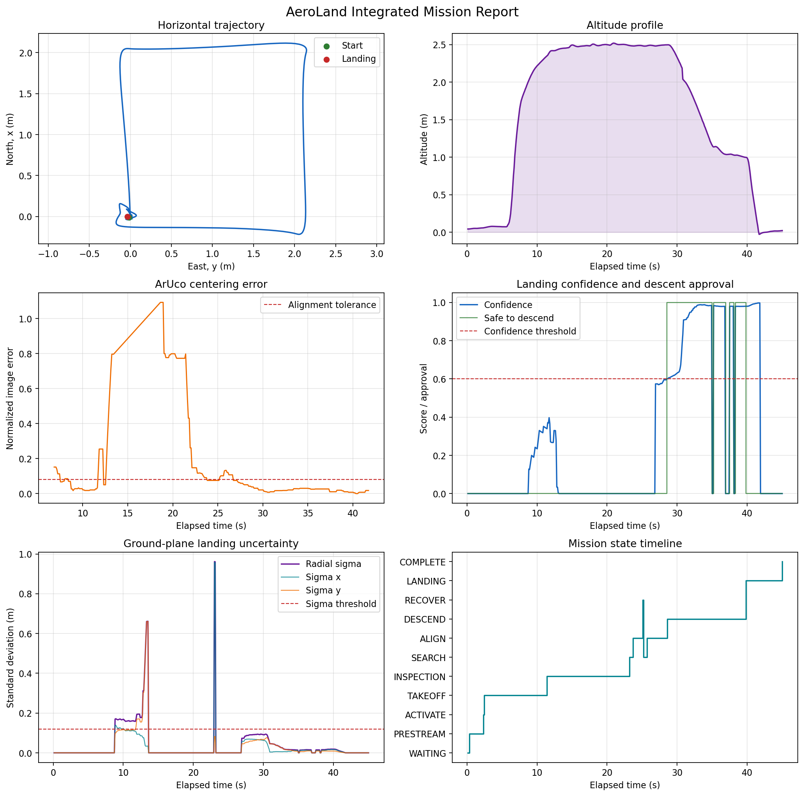
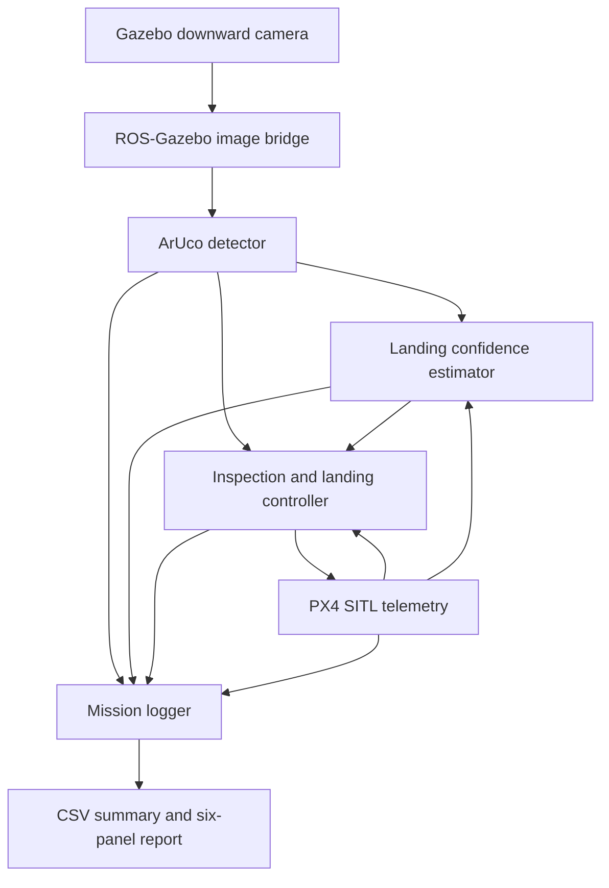
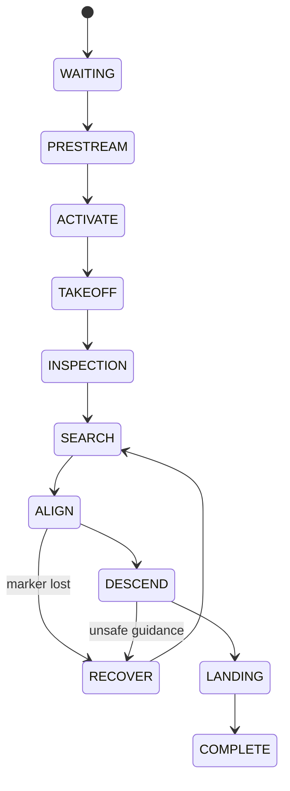

# AeroLand

**Uncertainty-Aware Autonomous Aerial Inspection and Precision Landing**

[](https://docs.ros.org/en/humble/)
[](https://px4.io/)
[](https://gazebosim.org/)
[](https://www.python.org/)
[](src/aeroland_landing/LICENSE)

AeroLand is a simulation-first aerial robotics platform built with ROS 2,
PX4, and Gazebo. It autonomously flies an inspection route, returns to a
visual landing target, estimates the uncertainty of ArUco-based guidance,
and permits descent only when perception confidence satisfies explicit
safety thresholds.

The project combines autonomy, perception, flight control, uncertainty
estimation, safety logic, telemetry logging, and mission analysis in one
reproducible system.



## Verified Mission Results

The following results were recorded from a complete PX4 SITL mission in the
Gazebo `aruco` world using the `x500_mono_cam_down` vehicle:

| Metric | Result |
| --- | ---: |
| Mission status | Complete |
| Mission duration | 44.9 s |
| Maximum altitude | 2.519 m |
| Final horizontal landing error | 0.036 m |
| Marker availability during guidance | 100.0% |
| Mean marker error during descent | 0.021 |
| Maximum marker error during descent | 0.042 |
| Mean landing confidence during descent | 0.818 |
| Mean ground-plane sigma during descent | 0.033 m |
| Maximum ground-plane sigma during descent | 0.094 m |
| Uncertainty-approved descent samples | 91.1% |
| Uncertainty pause events | 3 |
| Recovery events | 1 |

During this run, the controller refused descent below the confidence
threshold, paused three times when measurements became temporarily invalid,
resumed when visual uncertainty became acceptable, and landed successfully.

## System Architecture



## Mission Sequence

1. Wait for valid PX4 telemetry.
2. Stream offboard safety setpoints.
3. Enter offboard mode and arm.
4. Take off to 2.5 m.
5. Fly three inspection waypoints.
6. Return to the launch area.
7. Search for and align with ArUco marker ID 0.
8. Estimate visual confidence and ground-plane uncertainty.
9. Descend only while uncertainty is acceptable.
10. Pause or recover if visual guidance becomes unsafe.
11. Hand off to PX4 landing and confirm disarm.

The controller publishes its current state on
`/aeroland/mission/state`. The principal states are:



## Uncertainty-Aware Descent

The landing-confidence estimator maintains a rolling window of normalized
ArUco image errors. It calculates sample dispersion and maps that dispersion
onto the camera ground plane using vehicle altitude and camera field of view.

Descent approval requires all of the following:

- Recent marker measurements
- At least eight samples in the active window
- Marker availability of at least 75%
- Centering error no greater than 0.10
- Radial ground-plane sigma no greater than 0.12 m
- Landing confidence of at least 0.60
- Mission state equal to `ALIGN` or `DESCEND`

The controller independently checks that approval messages are recent. If
approval is false or stale, it holds altitude. Sustained loss initiates
recovery, while near-ground marker loss safely hands control to PX4 landing.

This estimator is an empirical rolling measurement-uncertainty model, not a
full vehicle-state covariance estimator. Its thresholds are currently tuned
and validated in simulation.

## ROS 2 Packages

| Package | Responsibility |
| --- | --- |
| `aeroland_core` | Mission-management foundations |
| `aeroland_navigation` | Early navigation and Turtlesim validation |
| `aeroland_control` | PX4 offboard and waypoint-control experiments |
| `aeroland_perception` | Downward-camera ArUco detection and image error |
| `aeroland_landing` | Precision landing and integrated inspection mission |
| `aeroland_uncertainty` | Landing confidence, sigma, and descent approval |
| `aeroland_analysis` | CSV telemetry logging and mission reports |
| `aeroland_bringup` | Unified ROS 2 launch configurations |

## Important Topics

| Topic | Type | Purpose |
| --- | --- | --- |
| `/aeroland/perception/marker_detected` | `std_msgs/Bool` | Marker visibility |
| `/aeroland/perception/marker_id` | `std_msgs/Int32` | Detected marker ID |
| `/aeroland/perception/marker_error` | `geometry_msgs/Vector3Stamped` | Normalized image-plane error |
| `/aeroland/perception/annotated_image` | `sensor_msgs/Image` | Detection visualization |
| `/aeroland/mission/state` | `std_msgs/String` | Mission state-machine output |
| `/aeroland/uncertainty/landing_confidence` | `std_msgs/Float32` | Confidence from 0 to 1 |
| `/aeroland/uncertainty/marker_sigma` | `geometry_msgs/Vector3Stamped` | Ground-plane sigma X, Y, radial |
| `/aeroland/uncertainty/safe_to_descend` | `std_msgs/Bool` | Closed-loop descent approval |

PX4 communication uses versioned `/fmu/in/*` and `/fmu/out/*` topics supplied
by `px4_msgs` and the Micro XRCE-DDS Agent.

## Tested Environment

- Windows 11 with WSL 2
- Ubuntu 22.04
- ROS 2 Humble
- Python 3.10
- PX4 SITL
- Gazebo Sim 8
- QGroundControl 5
- OpenCV with the ArUco module
- Matplotlib

Required ROS/PX4 components include `px4_msgs`, `ros_gz_image`,
`cv_bridge`, and the Micro XRCE-DDS Agent.

## Build

```bash
cd ~/aeroland_ws
source /opt/ros/humble/setup.bash

PYTHONNOUSERSITE=1 colcon build --symlink-install

source install/setup.bash
```

`PYTHONNOUSERSITE=1` keeps ROS 2 on the tested system Python environment and
prevents user-installed NumPy packages from conflicting with OpenCV and
`cv_bridge`.

## Run the Integrated Mission

Start each component in a separate terminal.

### 1. Micro XRCE-DDS Agent

```bash
MicroXRCEAgent udp4 -p 8888
```

### 2. PX4 SITL and Gazebo

```bash
cd ~/PX4-Autopilot

HEADLESS=1 PX4_GZ_WORLD=aruco make \
px4_sitl gz_x500_mono_cam_down
```

### 3. QGroundControl

```bash
cd ~
QT_QPA_PLATFORM=xcb ./QGroundControl-5.0.8.AppImage
```

### 4. AeroLand

```bash
cd ~/aeroland_ws
source /opt/ros/humble/setup.bash
source install/setup.bash

PYTHONNOUSERSITE=1 ros2 launch \
aeroland_bringup inspection_mission.launch.py \
start_mission:=true
```

To start the camera bridge, perception, uncertainty, and logger nodes without
arming the vehicle, use:

```bash
PYTHONNOUSERSITE=1 ros2 launch \
aeroland_bringup inspection_mission.launch.py \
start_mission:=false
```

## Run from the Mission Console

The `web` directory includes a local mission API that can launch the same
headless PX4/Gazebo mission from the website. It validates all public inputs,
allows only one real simulation at a time, enforces a timeout, records separate
process logs, and labels synthetic and Gazebo telemetry distinctly.

Follow [`web/LIVE_BACKEND.md`](web/LIVE_BACKEND.md) to test the API connection
and then enable the real runner on Ubuntu/WSL.

## Mission Logs and Reports

CSV logs are written to:

```text
~/aeroland_ws/mission_logs/aeroland_mission_<UTC timestamp>.csv
```

Each row records:

- Mission state and elapsed time
- PX4 local position and altitude
- Marker visibility and centering error
- Landing confidence
- Ground-plane sigma X, Y, and radial magnitude
- Safe-to-descend approval

Generate a report for the newest mission:

```bash
cd ~/aeroland_ws
source /opt/ros/humble/setup.bash
source install/setup.bash

PYTHONNOUSERSITE=1 ros2 run \
aeroland_analysis mission_report
```

The report generator produces:

- A numerical summary (`*_summary.txt`)
- A six-panel mission plot (`*_report.png`)

An explicit CSV path may also be supplied:

```bash
PYTHONNOUSERSITE=1 ros2 run aeroland_analysis mission_report \
~/aeroland_ws/mission_logs/aeroland_mission_<timestamp>.csv
```

## Tests

Run all package tests:

```bash
cd ~/aeroland_ws
source /opt/ros/humble/setup.bash

PYTHONNOUSERSITE=1 colcon test \
--event-handlers console_direct+

PYTHONNOUSERSITE=1 colcon test-result --verbose
```

The current workspace passes its Python syntax, Flake8, and PEP 257 checks.

## Repository Structure

```text
aeroland_ws/
├── README.md
├── docs/
│   └── images/
│       └── aeroland_full_uncertainty_report.png
├── src/
│   ├── aeroland_analysis/
│   ├── aeroland_bringup/
│   ├── aeroland_control/
│   ├── aeroland_core/
│   ├── aeroland_landing/
│   ├── aeroland_navigation/
│   ├── aeroland_perception/
│   └── aeroland_uncertainty/
└── mission_logs/              # Generated locally and ignored by Git
```

## Limitations

- Simulation-only validation; no physical flight testing yet
- Fixed camera model and ArUco dictionary/marker configuration
- Confidence thresholds tuned for the current Gazebo scenario
- No environmental lighting, wind, or camera-noise campaign yet
- Ground-plane sigma estimates measurement consistency rather than full
  navigation-state uncertainty

## Roadmap

- Automated Monte Carlo mission runner
- Noise, dropout, initial-offset, and wind sweeps
- Confidence calibration and success-probability curves
- Comparison against landing without uncertainty gating
- Automated regression tests for mission-state transitions
- Validated Gazebo wind-disturbance and seed control
- Live downward-camera streaming in the mission console
- Hardware-in-the-loop and physical-flight validation

## Author

Developed by **Shivali Shrivastava** as a portfolio and research-oriented
autonomous robotics project spanning ROS 2, PX4, computer vision, control,
uncertainty estimation, and simulation.

## License

AeroLand ROS 2 packages are distributed under the Apache License 2.0.
